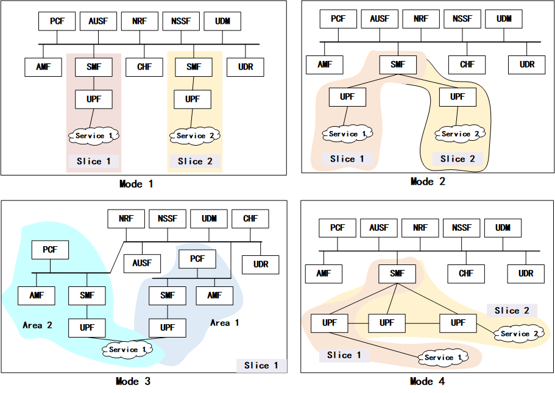

# 5GSliceNet

5GSliceNet, an open-source project that aims to develop a tool to design 5G core slices, 
provides an easy-to-use, cross-platform, automatic solution for multi-slice network research. 
5GSliceNet generates a slices network deployment files according to the user's requirements. Its network components are from 
[UERANSIM](https://github.com/aligungr/UERANSIM) and [Free5GC](https://github.com/free5gc/free5gc).

## Overview

5GSliceNet supports the following four slice forms:

| Mode | Description                                                                       | Common Network Functions | Specific Network Functions | Other Network Functions |
| --- |-----------------------------------------------------------------------------------|--------------------------|----------------------------|-------------------------|
| 1 | N Slices = n × (1 UPF + 1 SMF)                                                    | AMF、AUSF、NRF、NSSF        | UPF、SMF                    | CHF、UDR、UDM、PCF         |
| 2 | N Slices = n × (1 UPF)                                                            | AMF、AUSF、NRF、NSSF、SMF    | UPF                        | CHF、UDR、UDM、PCF         |
| 3 | Select nearby UPF according to the connected gNodeB (Multiple areas in one slice) | AUSF、NRF、NSSF            | AMF、PCF、SMF、UPF            | CHF、UDR、UDM             |
| 4 | ULCL                                                                              | AMF、AUSF、NRF、NSSF        | SMF、UPF                    | CHF、UDR、UDM、PCF         |
| 5 | Mixed                                                                             | -                        | -                          | -                       |



## Getting Started


### Prerequisites
- Kubernetes
- Docker
- Helm

### How to use
1. clone the basic charts from the repository:
```shell
git clone https://github.com/hackeryounow/5gc-basic-charts
mv 5gc_basic_charts charts
```
2. Generate the network deployment files:
```shell
# slice1 = SliceNetModeOne(2, ["internet", "internet"], path="5gc_mode1_1")
# slice1.configure()
# slice2 = SliceNetModeTwo(2, ["internet", "internet"], path="5gc_mode2_1")
# slice2.configure()
# slice3 = SliceNetModeThree(1, ["internet"], 2)
# slice3.configure()
# slice4 = SliceNetModeFour(1, ["internet"], path="5gc_mode4_1")
# slice4.configure()
```
3. Deploy the 5g slicenet charts:
```shell
# create namespace and persistent volume
kubectl create ns free5gc
cat <<EOF | kubectl apply -f -
apiVersion: v1
kind: PersistentVolume
metadata:
  name: example-local-pv9
  labels:
    project: free5gc
spec:
  capacity:
    storage: 8Gi
  accessModes:
  - ReadWriteOnce
  persistentVolumeReclaimPolicy: Retain
  local:
    path: /opt/kubedata/
  nodeAffinity:
    required:
      nodeSelectorTerms:
      - matchExpressions:
        - key: kubernetes.io/hostname
          operator: In
          values:
          - ubuntu
EOF
# update the charts
helm dependency update free5gc
# deploy the charts
helm install free5gc free5gc -n free5gc
```
Note 1: The persistent volume path is `/opt/kubedata/` in the example. You can change it to your own path. 
Note 2: The node name is `ubuntu` in the example (Kubernetes cluster has a single master without worker node). You have to change it to your own node name.
Note 3: If the mongodb is not running, please edit the persistent volume and delete the `claimRef`.